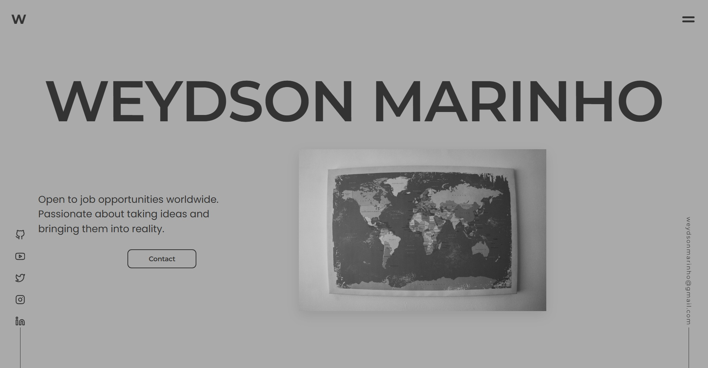

# Portfolio - Weydson Marinho



> "Transforming ideas into reality via code and design."

A digital portfolio focused on **User Experience (UX)**, **visual storytelling**, and **performance**. Inspired by an editorial and journalistic aesthetic, this project demonstrates front-end development skills with a special emphasis on creative interactions without relying on UI frameworks.

🔗 **Live:** [Here](https://weym.github.io/)
🎨 **Design System** [Here](https://weym.github.io/pages/case-study.html)

---

## 📑 Table of Contents

- [🖋️ The Garden: Custom Blog System](#️-the-garden-custom-blog-system)
- [✨ Other Feature Highlights](#-other-feature-highlights)
- [🎨 Design System](#-design-system)
- [🚀 Technical Implementation](#-technical-implementation)
- [⚙️ How to Run Locally](#️-how-to-run-locally)
- [📬 Contact](#-contact)

---

## 🖋️ The Garden: Custom Blog System

The most significant feature of this portfolio is "The Garden," a custom-built, lightweight CMS-like engine that handles content dynamically.

### ⚙️ Architecture & Logic

- **Decoupled Content:** Content is managed in a dedicated [`digital-garden` repository](https://github.com/Weym/digital-garden/). The site fetches a `posts.json` manifest to map metadata and file paths.
- **Custom Markdown Parser:** A regex-based engine converts raw `.md` files into structured DOM elements (headers, lists, blockquotes, and images) without external libraries.
- **Client-Side Routing:** Uses `URLSearchParams` to detect slugs (e.g., `?post=how-to-take-notes`) and fetch the corresponding markdown file on the fly.
- **Interactive Features:** \* **Kinetic Slider:** A "Drag-to-scroll" interface on the home page for desktop users.
- **System Awareness:** The blog specifically respects `@media (prefers-color-scheme: dark)` to prioritize user accessibility.

---

## ✨ Other Feature Highlights

### 1. Immersive Theme Switching

Automatically switches between **Light Mode** and **Dark Mode** depending on the section the user is currently viewing to enhance the focus on visual content. This is controlled via `data-attributes` in the HTML and monitored by an `IntersectionObserver` in JS, creating an immersive atmosphere for each type of content.

### 2. Circular Navigation Menu

A unique approach to the mobile/desktop menu. Upon clicking the central toggle, the menu expands into animated concentric rings, utilizing rotation mathematics and transition delays.

### 3. Sticky Stacking Cards

In the "What I Do" section, skill cards use `position: sticky`. As the user scrolls down, the cards stack on top of one another, allowing for focused reading without losing the visual context.

### 4. Kinetic Sidebar Animations

The social and email sidebars feature a 90-degree rotation animation triggered by a `footerObserver` when reaching the bottom of the page, integrating them into the final layout frame.

---

## 🎨 Design System

The visual identity is built on a **Minimalist Two-Color Theory**. Instead of a static palette of 10+ colors, the entire site is generated from just two base hex codes.

- **Primary (Dark):** `#131313` (Soft Black)
- **Secondary (Light):** `#d0d0cd` (Warm Paper Gray)
- **Dynamic Shades:** All intermediate tones (borders, accents, and card backgrounds) are generated live by the browser using modern CSS:

  ```css
  /* Example of generating a subtle border */
  border: 1px solid color-mix(in srgb, var(--light), var(--dark) 20%);
  ```

- **Typography:**
  - _Montserrat:_ Titles and visual impact.
  - _Poppins:_ Body text and high-readability.
  - _Space Mono:_ Technical data, numbers, and code details.

---

## 🚀 Technical Implementation

By leveraging **Vanilla JavaScript (ES6+)** and **Modern CSS**, this project achieves high-performance interactions and a custom "framework-less" architecture.

### 🧠 Core Systems

- **Custom Markdown Parser:** A Regex-based engine that fetches and converts `.md` files into accessible DOM elements using the `Fetch API` and `URLSearchParams` for client-side routing.
- **Intelligent Theme Engine:** Uses the `IntersectionObserver API` to dynamically swap global CSS variables (`data-theme`) as sections enter the viewport for immersive transitions.
- **Fluid Design System:** Built with CSS Variables (`:root`) using `clamp()` for responsive typography and `color-mix()` for dynamic UI states.

### 🎨 Interaction & Motion

- **Sticky Stacking Cards:** Utilizes `position: sticky` and **CSS Grid** to create a depth-based scrolling experience for the skills section.
- **Circular Navigation:** An animated menu driven by rotation mathematics and concentric CSS transitions.
- **Kinetic UI:** Features a "drag-to-scroll" blog slider and a `footerObserver` that rotates sidebar elements 90° to "lock" them into the footer frame.
- **A11y & Performance:** Optimized for SEO via Semantic HTML5 and respects system preferences via `prefers-color-scheme` and `prefers-reduced-motion`.

---

## 🚀 How to Run Locally

This is a static project and does not require complex dependency installations.

1.  Clone the repository:
    ```bash
    git clone https://github.com/Weym/weym.github.io.git
    ```
    or
    ```bash
    git clone git@github.com:Weym/weym.github.io.git
    ```
2.  Navigate to the folder:
    ```bash
    cd your-repository
    ```
3.  Open the `index.html` file in your browser or use an extension like **Live Server** (VS Code) to simulate a local server.

---

## 📬 Contact

I am open to work opportunities worldwide.

- **Email:** weydsonmarinho@gmail.com
- **GitHub:** https://github.com/weym
